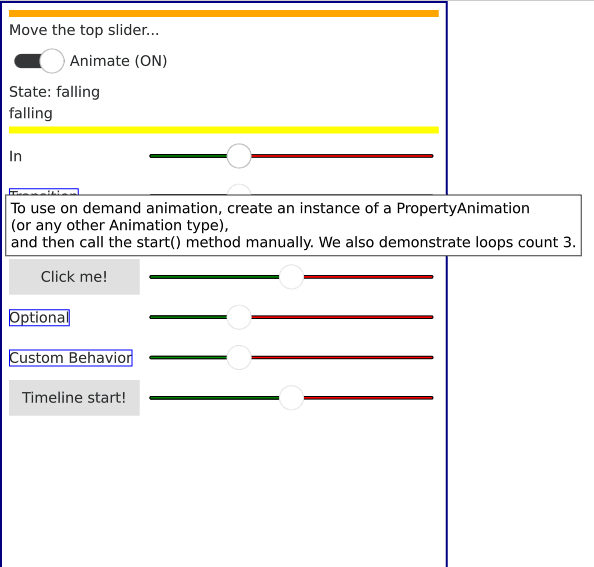

# LearnAnimationQML-WebAssembly

This is a small project for learning QML animations, states and transitions and the timeline. 
The WASM is not optimized yet to fit all content, thus you may need to zoom in or out a big to get all content.

See the details in the provided tooltips.

## Play Online

URL: https://nepa1234software.github.io/LearnAnimationQML-WebAssembly/appLearnAnimationQML.html

## Code

Repo URL: https://github.com/NePa1234Software/LearnAnimationQML

## Licensing

See the license file and License Folder for details
- The game is build using the Qt Framework opensource version (https://www.qt.io/licensing/)
- WebAssembly build powered by emscription SDK (https://emscripten.org/docs/introducing_emscripten/emscripten_license.html)

## Screenshots

